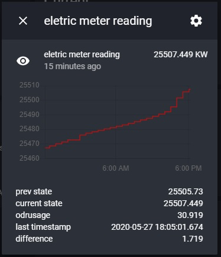

# pysmtreader (Python based SMT Reader):

A Python application to poll your smart electric meter, this application uses an undocumented API for [Smart Meter Texas](https://www.smartmetertexas.com). 

**Huge thanks** to [u/keatontaylor for the API Details](https://github.com/keatontaylor/smartmetertexas-api), without his documentation none of this would have been possible.

# What it does
It polls [Smart Meter Texas](https://www.smartmetertexas.com) to get electric meter reading every hour (can be configured to read maximum twice per hour as restricted by SmartMeterTexas). Once read it will send read data to [Home Assistant](https://www.home-assistant.io/) 

# How to use
Applicaton is available at Docker Hub and can be used in one of the two ways:
1. Docker

   Run the following command:
~~~
docker run -d -v ./config/:/config scadaguru/pysmtreader
~~~

2. Docker Compose

~~~
version: "3"
services:
    pysmtreader:
        container_name: pysmtreader
        image: scadaguru/pysmtreader
        volumes:
            - ./config/:/config
        restart: unless-stopped
~~~

# Update config.yaml file
Update default config,yaml with your information mentioned below:
Please update username, password, esiid, meter_number, base_url and access_token lines in the default config.yaml by removing "__REPLACE__" and providing your values otherwise application will not run!

~~~
logs:
    level: debug # debug, info(default), warning, error, critical
    log_file_name: pysmt # without extension, log extension will be added automatically

health_check:
    log_info_line_at: 30 # in minutes, 0: disable

smartmetertexas: # smartmetertexas.com
    base_url: https://smartmetertexas.com/api
    username: _REPLACE_ # Update with your username to access smartmetertexas.com
    password: _REPLACE_ # Update with your password to access smartmetertexas.com
    esiid: _REPLACE_ # Update with your ESSID, you can find from your electric bill or once you login to smartmetertexas.com
    meter_number: _REPLACE_ # Update with your Meter Number, you can find in your electric bill or once you login to smartmetertexas.com
    poll_interval_minutes: 60 # 0: disable, do set below 30 as smartmetertexas.com will not allow reading more than twice in an hour
    wait_interval_before_ondemand_read_minutes: 5
    force_first_read: False # if true it will attempt to read Smart Meter Texas, otherwise at poll_interval

home_assistant: # Home Assistant access details
    base_url: _REPLACE_ # your Home Assistant URL/IP, no slash (/) at the end for example: http://192.168.1.149:8123
    access_token: _REPLACE_ # your Home Assistant access token
    ha_entity: sensor.smt_reading # home assistnat entity name to be created
~~~

# Data Sent to Home Assistant
~~~
    current_state: Latest reading value
    prev_state: Previous reading value
    difference: This is computed difference from latest and previoud reading, so if you polling once an hour it is  hourly usage
    unit_of_measurement: KW
    odrusage: This is provided by smartmetertexas.com and most likely it is total since last day
    last_timestamp: Last read time in the format of 2020-05-27 14:30:01.674
~~~

